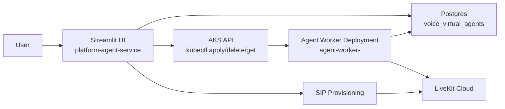

# Platform Agent

Config-driven LiveKit voice agent builder with a Streamlit control plane and Kubernetes-managed worker deployments.

## Overview

This project lets you:

- create a LiveKit agent configuration from a UI
- store that configuration in the existing `voice_virtual_agents` database table
- provision SIP trunks and dispatch rules
- deploy agent workers to AKS using a shared base worker image
- inspect and stop worker deployments from the UI

## Architecture



### Runtime Flow

1. A user creates an agent in the UI.
2. The config is validated and saved to `voice_virtual_agents` with `agent_type='livekit'`.
3. The saved agent appears in the deployment dropdown because the UI reads agents from the DB filtered by `agent_type='livekit'`.
4. When the user clicks `Deploy`, the service renders a Kubernetes manifest and applies it to AKS.
5. AKS starts a worker pod from the shared worker image.
6. The worker uses `TARGET_AGENT_NAME` to load its config from the DB and connects to LiveKit.

## Components

- [streamlit_app.py](/Users/mridulrao/Downloads/psuedo_desktop/platform_agent/streamlit_app.py): UI for create, deploy, stop, and status
- [backend_service.py](/Users/mridulrao/Downloads/psuedo_desktop/platform_agent/backend_service.py): save/deploy/delete/status helpers
- [agent_config/store.py](/Users/mridulrao/Downloads/psuedo_desktop/platform_agent/agent_config/store.py): DB-backed config persistence
- [livekit_agents/create_agent.py](/Users/mridulrao/Downloads/psuedo_desktop/platform_agent/livekit_agents/create_agent.py): worker entrypoint
- [scripts/render_k8s_runtime_config.py](/Users/mridulrao/Downloads/psuedo_desktop/platform_agent/scripts/render_k8s_runtime_config.py): renders namespace/configmap/secret from `.env`
- [scripts/render_k8s_worker_manifest.py](/Users/mridulrao/Downloads/psuedo_desktop/platform_agent/scripts/render_k8s_worker_manifest.py): renders per-agent worker deployment YAML
- [k8s/service-deployment.yaml](/Users/mridulrao/Downloads/psuedo_desktop/platform_agent/k8s/service-deployment.yaml): Streamlit service deployment
- [k8s/service-rbac.yaml](/Users/mridulrao/Downloads/psuedo_desktop/platform_agent/k8s/service-rbac.yaml): service account and RBAC for in-cluster deploys

## Environment

Use [`.env.local`](/Users/mridulrao/Downloads/psuedo_desktop/platform_agent/.env.local) for local runtime configuration instead of passing variables individually in commands or duplicating them in docs.

Generate Kubernetes runtime config from `.env`:

```bash
./.venv/bin/python scripts/render_k8s_runtime_config.py > k8s/runtime-config.generated.yaml
kubectl apply -f k8s/runtime-config.generated.yaml
```

## Local Development

Run the UI locally:

```bash
./.venv/bin/streamlit run streamlit_app.py
```

Local UI mode works as long as your machine has:

- access to the database
- `kubectl` configured for the AKS cluster
- the required env vars loaded

## Kubernetes Deployment

Build and push images:

```bash
docker buildx build --platform linux/amd64 -f Dockerfile.service -t fpaiopsstaging.azurecr.io/platform-agent-service:latest --push .
docker buildx build --platform linux/amd64 -f Dockerfile.worker -t fpaiopsstaging.azurecr.io/platform-agent-worker:latest --push .
```

Apply cluster config:

```bash
kubectl apply -f k8s/runtime-config.generated.yaml
kubectl apply -f k8s/service-rbac.yaml
kubectl apply -f k8s/service-deployment.yaml
```

Access the in-cluster UI:

```bash
kubectl port-forward -n platform-vva-agent svc/platform-agent-service 8501:80
```

## UI Workflow

1. `Create agent`
   Saves config to the DB only.
2. `Create SIP trunk`
   Provisions SIP resources separately.
3. `Agent Deployment -> Deploy`
   Deploys the worker to AKS.
4. `Agent Deployment -> Status`
   Shows deployment status and running worker counts.
5. `Agent Deployment -> Stop`
   Deletes the worker deployment and service.

## Observability

Check service logs:

```bash
kubectl logs -n platform-vva-agent deploy/platform-agent-service -f
```

Check worker logs:

```bash
kubectl logs -n platform-vva-agent deploy/agent-worker-<agent-name> -f
```

List deployed workers:

```bash
kubectl get deploy,svc,pods -n platform-vva-agent
```

## TODO

- Add Ingress setup for the Streamlit service with DNS and TLS.
- Add authentication in front of the dashboard.
- Show worker logs directly in the UI.
- Replace mutable `latest` tags with versioned release tags.
