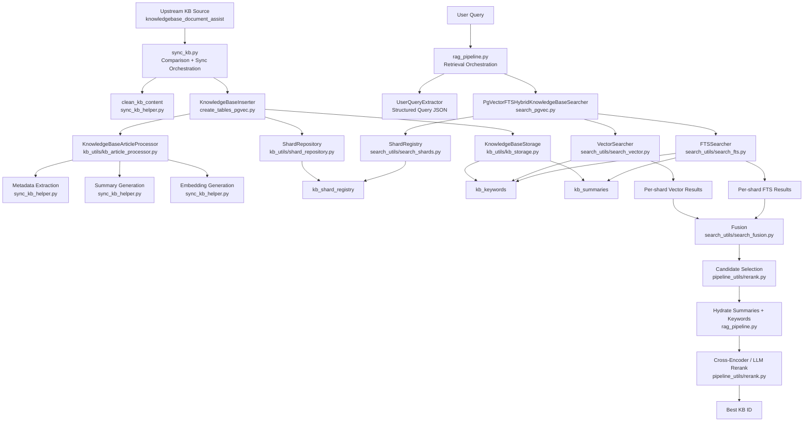

# Indexing and RAG Retrieval Architecture

This module owns two connected systems:

1. Document indexing and synchronization into PostgreSQL + pgvector
2. Query-time retrieval and reranking for RAG

The code is organized so that ingestion, storage, retrieval, fusion, and reranking are separate concerns, while still sharing a common schema and config layer.

## High-Level Overview

At a high level, the system works like this:

1. Source KB documents are pulled from the upstream document table.
2. Each document is cleaned, normalized, summarized, and converted into structured metadata plus embeddings.
3. The processed document is written into two logical stores:
   - `kb_keywords`: one row per keyword/use case/entity/acronym with embedding columns
   - `kb_summaries`: one row per document with summary, intent, triggers, and content
4. Documents are assigned to shards so retrieval can search smaller partitions instead of one large flat index.
5. At query time, the user query is normalized into structured search terms.
6. Retrieval runs hybrid search per shard:
   - vector similarity
   - FTS over keywords
   - FTS over summaries
7. Results are fused, narrowed to candidates, hydrated with richer document context, and reranked.
8. The best KB document ID is returned for downstream answer generation.

## Architecture Diagram



## Core Design Principles

### 1. Two-table indexing model

The system separates retrieval signals into two complementary tables:

- `kb_keywords`
  Stores structured, search-oriented rows such as:
  - specific keywords
  - generic keywords
  - use cases
  - secondary entities
  - acronyms
  Each row can carry one embedding column depending on the field being represented.

- `kb_summaries`
  Stores one document-level row with:
  - article title
  - primary intent
  - query triggers
  - secondary mentions
  - summary
  - cleaned content

This lets retrieval use both:

- dense semantic matching on compact metadata
- lexical search on document summaries and triggers

### 2. Shard-aware indexing and retrieval

The index is split by `kb_collection_id` and `shard_id`.

This is important because:

- large flat vector indexes become harder to query efficiently
- shard fan-out keeps retrieval bounded
- shard registry lets ingestion and retrieval share the same source of truth

The shard registry lives in `kb_shard_registry` and is used by:

- ingestion to assign new documents
- retrieval to know which shards to search

### 3. Hybrid retrieval, not vector-only

The retrieval path intentionally combines multiple signals:

- vector similarity over keyword embeddings
- FTS keyword matching
- FTS summary matching

This improves recall and also makes the system more robust when:

- the query uses exact product names
- the query uses paraphrases
- the query uses intent-level wording instead of document wording

### 4. Retrieval first, rerank second

The retrieval phase focuses on broad recall.
The rerank phase focuses on precision.

That separation keeps the pipeline easier to tune:

- retrieval knobs affect candidate quality and recall
- rerank knobs affect final winner quality

## Module-by-Module Breakdown

## Configuration Layer

- `indexing_config.py`

This is the shared configuration entry point for the indexing and retrieval stack.
It centralizes:

- Azure OpenAI client setup
- embedding model settings
- PostgreSQL/pgvector settings
- retrieval weights and top-k knobs
- rerank strategy and thresholds

All runtime modules should depend on `indexing_config`, not on scattered environment lookups.

## Database and Storage Layer

- `pgvec_client.py`
- `kb_utils/kb_db.py`
- `kb_utils/kb_storage.py`
- `kb_utils/shard_repository.py`

Responsibilities:

- create and cache PostgreSQL clients
- manage pooling and search path
- insert and delete keyword rows and summary rows
- manage shard assignment and shard capacity accounting

### Storage schema

`create_tables_pgvec.py` creates and maintains:

- `kb_keywords`
- `kb_summaries`
- `kb_shard_registry`

It also creates:

- collection-aware indexes
- shard-aware indexes
- pgvector IVFFlat indexes on embedding columns

## Ingestion / Sync Layer

- `sync_kb.py`
- `sync_kb_helper.py`
- `create_tables_pgvec.py`
- `kb_utils/kb_article_processor.py`

### `sync_kb.py`

This is the top-level indexing orchestrator.
It:

1. Reads upstream KB documents
2. Normalizes titles and KB IDs
3. Skips scenario documents
4. Compares upstream docs against indexed docs
5. Splits work into:
   - new documents
   - updated documents
   - deleted documents
6. Calls the inserter/deleter APIs
7. Rebuilds the software/hardware expansion tables after sync

### `KnowledgeBaseInserter` in `create_tables_pgvec.py`

This is the write-side domain service.
It owns:

- table bootstrap
- shard assignment
- update/delete flow
- article processing invocation
- keyword insertion
- summary insertion
- traceability logging

### `KnowledgeBaseArticleProcessor`

This is the document transformation layer between raw document text and database rows.

For each article, it performs:

1. metadata extraction
2. article summary generation
3. embedding generation
4. row preparation for:
   - keyword rows
   - summary row

That keeps LLM-based processing out of the storage classes.

## Retrieval Layer

- `rag_pipeline.py`
- `search_pgvec.py`
- `search_utils/search_vector.py`
- `search_utils/search_fts.py`
- `search_utils/search_fusion.py`
- `pipeline_utils/rerank.py`

### Step 1: Query parsing

`rag_pipeline.py` starts by converting a raw user query into structured query JSON.

It uses:

- `UserQueryExtractor` when available
- normalization and fallback logic when extractor output is missing or weak

The normalized query contains fields like:

- category
- specific keywords
- generic keywords
- use case
- acronyms
- search phrases

This structured shape is what drives retrieval.

### Step 2: Hybrid search

`search_pgvec.py` owns the main searcher:

- `PgVectorFTSHybridKnowledgeBaseSearcher`

It runs retrieval against one collection and discovers active shards from the shard registry.

For each shard, it can run:

- vector search via `VectorSearcher`
- FTS keyword search via `FTSSearcher`
- FTS summary search via `FTSSearcher`

### Vector path

`search_utils/search_vector.py`:

- embeds the query text
- compares it against the chosen embedding column
- boosts exact and phrase matches
- applies category-sensitive distance multipliers

### FTS path

`search_utils/search_fts.py`:

- runs keyword FTS against `kb_keywords`
- runs summary FTS against `kb_summaries`
- adds bonuses for exact and phrase matches
- keeps collection and shard scope in the SQL predicate

### Fusion

`search_utils/search_fusion.py` combines the signal outputs.

Despite the historical `rrf` naming, the implementation is a weighted normalized score fusion:

- vector scores are normalized as lower-is-better
- FTS scores are normalized as higher-is-better
- documents matching across multiple signals get a bonus
- exact and phrase matches get additional boosts

This avoids mixing raw score scales directly while still preserving useful magnitude differences.

## Reranking Layer

### Per-shard rerank

In `rag_pipeline.py`, each shard produces an initial candidate list.

That list is then:

1. reduced by heuristic candidate selection
2. hydrated with summary and keyword metadata from the DB
3. reranked to choose a shard winner

### Final rerank across shards

After every shard returns a winner or candidate set:

1. candidate IDs are merged across shards
2. document metadata is hydrated again
3. one final rerank chooses the best KB document overall

### `pipeline_utils/rerank.py`

This layer supports:

- heuristic direct-pick shortcuts
- cross-encoder reranking
- optional LLM reranking
- candidate family deduplication

This gives you a two-stage precision strategy:

- lightweight heuristics when the answer is obvious
- stronger reranking when several candidates look plausible

## End-to-End Flows

## Indexing Flow

```text
Upstream docs
-> compare with indexed docs
-> clean content
-> extract metadata
-> generate summary
-> generate embeddings
-> assign shard
-> write keyword rows
-> write summary row
-> update shard registry
```

## Retrieval Flow

```text
User query
-> structured query JSON
-> per-shard hybrid retrieval
-> fuse vector + FTS signals
-> candidate selection
-> hydrate summary/keyword context
-> per-shard rerank
-> final cross-shard rerank
-> best KB ID
```

## Why the Current Architecture Works Well

The strongest parts of the current architecture are:

- ingestion and retrieval are clearly separated
- storage concerns are not mixed with LLM transformation logic
- sharding is a first-class concept on both write and read paths
- hybrid retrieval gives better recall than vector-only search
- reranking is isolated enough to evolve independently

## Current Constraints and Tradeoffs

A few tradeoffs are built into the design:

- query-time retrieval is more complex than a single ANN lookup
- the system depends on LLM-based enrichment during indexing
- rerank quality depends on summary quality and candidate hydration quality
- sharding improves scalability, but adds orchestration complexity

These are reasonable tradeoffs for a KB assistant where precision matters.

## Important Files

- `indexing_config.py`: shared config and client construction
- `sync_kb.py`: sync orchestration
- `sync_kb_helper.py`: cleaning, metadata extraction, summaries, embeddings
- `create_tables_pgvec.py`: schema bootstrap and ingest write service
- `kb_utils/kb_article_processor.py`: per-document transformation
- `kb_utils/kb_storage.py`: DB write/read helpers for indexed tables
- `kb_utils/shard_repository.py`: shard assignment and accounting
- `search_pgvec.py`: hybrid search orchestration
- `search_utils/search_vector.py`: vector retrieval
- `search_utils/search_fts.py`: FTS retrieval
- `search_utils/search_fusion.py`: score fusion
- `rag_pipeline.py`: top-level retrieval and final candidate selection
- `pipeline_utils/rerank.py`: rerank and direct-pick logic

## Summary

This architecture is a shard-aware hybrid retrieval system built on top of PostgreSQL, pgvector, and FTS.

It is designed around a simple idea:

- enrich documents heavily at indexing time
- retrieve broadly with multiple signals
- rerank carefully at query time

That design gives you a practical RAG stack that balances recall, precision, and maintainability.
